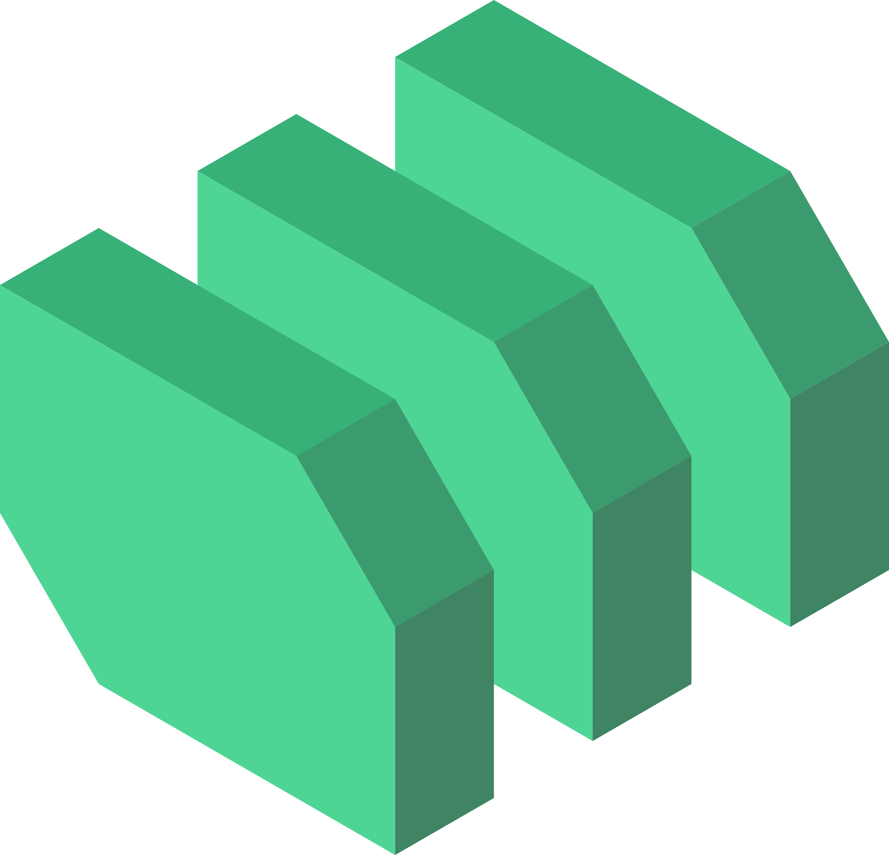



  

    
    
    

    
    

<h1 align="center">Inferyn</h1>

A large language model (LLM) inference interface that allows for the use of various local and remote LLMs. Models and servers can be switched on the fly without losing conversational context.

## 📜 License

This project is dual-licensed:

- 🆓 **Open Source License:**  
  Licensed under the [GNU General Public License v3.0](LICENSE).  
  You may use, modify, and distribute this software as long as your project is also open source under GPLv3.

- 💼 **Commercial License:**  
  For closed-source or commercial use, you must purchase a commercial license.  
  See [COMMERCIAL_LICENSE.md](COMMERCIAL_LICENSE.md) or contact me at [inferyn.contact@proton.me].

